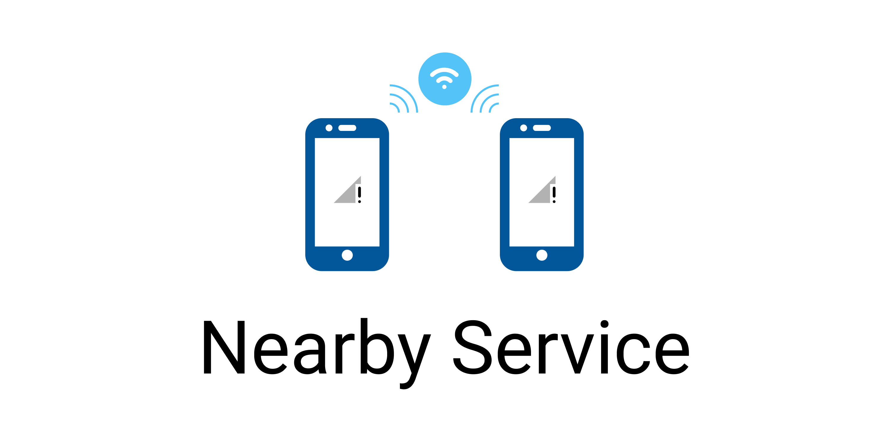

# Nearby Service

#### Connecting phones in a P2P network

[](https://xenikii.one)
[](https://github.com/ksenia312/nearby_service/blob/main/LICENSE)

Nearby Service Flutter Plugin is used to create connections in a P2P network. With this plugin you can easily create any
kind of information sharing application **without Internet connection**.

## Table of Contents

- [About](#about)
  - [Android](#android_about)
  - [IOS](#ios_about)
- [Setup](#setup)
  - [Android](#android_setup)
  - [IOS](#ios_setup)
- [Usage](#usage)
- [Features](#features)
- [Contributing](#contributing)
- [License](#license)

## About

> A peer-to-peer (P2P) network is a decentralized network architecture in which each participant, called a peer, can act
> as both a client and a server. This means that peer-to-peer networks can exchange resources such as files, data or
> services directly with each other without needing a central authority or server.

### Android <a id="android_about"></a>

For Android, **Wi-fi Direct** is used as a P2P network.

It is implemented through the `android.net.wifi.p2p` module.
It **requires** permissions for `ACCESS_FINE_LOCATION` and `NEARBY_WIFI_DEVICES` (for Android 13+).

It is also important that you need **Wi-fi enabled** on your device to use it.

To check permissions and Wi-fi status, the
`nearby_service` plugin includes a set of methods:

- `checkWifiService()` (Android only): returns true if Wi-fi is enabled
- `requestPermissions()` (Android only): requests permissions for location and nearby devices and returns true if
  granted
- `openServicesSettings()`: opens Wi-fi settings for Android and general settings for iOS

### IOS <a id="ios_about"></a>

For IOS, the P2P connection is implemented through the `Multipeer Connectivity` framework.

This framework **automatically selects** the best network technology depending on the situation - using **Wi-Fi** if
both
devices are on the same network, or using **peer-to-peer Wi-Fi** or **Bluetooth** otherwise.

The module will work even with Wi-fi turned off (via Bluetooth), but you can still use `openServicesSettings()` from
the `nearby_service` plugin to open the settings and prompt the user to turn Wi-fi on.

## Setup

### Android <a id="android_setup"></a>

All necessary Android permissions are already in the **AndroidManifest.xml** of the plugin
so you don't need to add anything **to work with p2p network**.

> Note that if you want to use the plugin **to send files**, you need to add
> ```xml
> <uses-permission android:name="android.permission.READ_EXTERNAL_STORAGE" /> 
> <uses-permission android:name="android.permission.WRITE_EXTERNAL_STORAGE" /> 
> ```
> to your **AndroidManifest.xml**.
> If you are using an external package to work with the device's file system,
> follow that package's documentation about managing with permissions.

### IOS <a id="ios_setup"></a>

For IOS, you need to add the following values to **Info.plist**:

```plist
<key>NSBonjourServices</key>
  <array>
    <string>_mp-connection._tcp</string>
  </array>
<key>UIRequiresPersistentWiFi</key>
<true/>
<key>NSLocalNetworkUsageDescription</key>
<string>[Your description here]</string>
```

- `NSBonjourServices`

  For the `nearby_service` plugin, you should add the value `<string>_mp-connection._tcp</string>`. This key is
  required for **Multipeer Connectivity**. It defines the Bonjour services
  that your application will look for. Bonjour is Apple's implementation of zero-configuration networking, which allows
  devices on a LAN to discover each other and establish connections without requiring manual configuration.

- `UIRequiresPersistentWiFi`

  This key is not strictly required for **Multipeer Connectivity** to work. This key is used
  to indicate that your application requires a persistent Wi-Fi connection even when the screen is off. This can be
  useful for maintaining a network connection for continuous data transfer.

- `NSLocalNetworkUsageDescription`

  This key is needed to inform users why your application will use the local network. You must provide a string value
  that explains why your application needs LAN access.

## Usage


